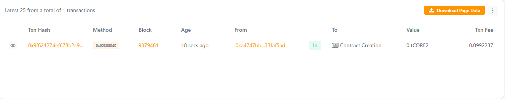

ChainRelic: Immutable On-Chain Record Preservation Protocol
Project Description

ChainRelic is a Solidity-based immutable record storage framework designed to preserve permanent digital artifacts on-chain. Each “Relic” represents a tamper-proof entry containing a title, metadata URI, creator identity, timestamp, and a unique cryptographic hash. Once stored, records cannot be modified or deleted, making ChainRelic ideal for digital certificates, compliance documentation, proof-of-existence, and heritage preservation.

ChainRelic ensures transparency, authenticity, and longevity for critical data across decentralized ecosystems.
Project Vision

The vision behind ChainRelic is to deliver a robust, censorship-resistant, and trustworthy blockchain vault for immutable record preservation.

Our goal is to empower:

Developers needing a permanent data layer

Businesses requiring verifiable audit records

Artists & creators who want provable authenticity

Institutions preserving historical or legal documents

ChainRelic aims to become the most reliable protocol for on-chain digital permanence.
Key Features

Immutable Record Storage:
Once created, Relics cannot be edited or removed — ensuring permanent preservation.

Decentralized Metadata Support:
Store IPFS/Arweave links or JSON URIs as proof-of-existence.

Unique Relic Hash:
Each Relic includes a cryptographic fingerprint for authenticity verification.

Creator Identity Tracking:
Every relic stores the creator’s address and timestamp.

Event Emission:
All relic storage activities emit events for off-chain indexing and compliance monitoring.

Simple Querying:
Retrieve any Relic by ID or fetch the entire preserved collection.
Future Scope

Relic versioning with off-chain diff comparison

Zero-knowledge proof integration for private relic verification

On-chain certificate issuance & NFT wrapping

Multi-signature approval for relic creation

Cross-chain relic synchronization

Metadata integrity validation through Merkle proofs

## Contract Details
0x371c0CEA9123FB96032b5B48b363b86A18d0e537

